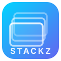
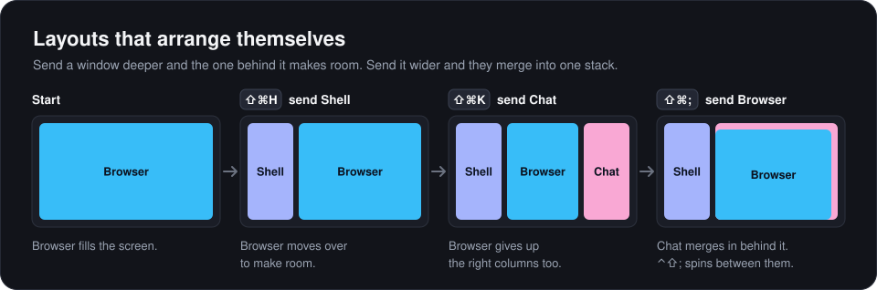
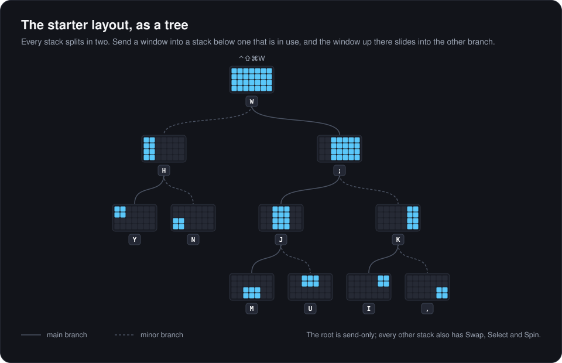
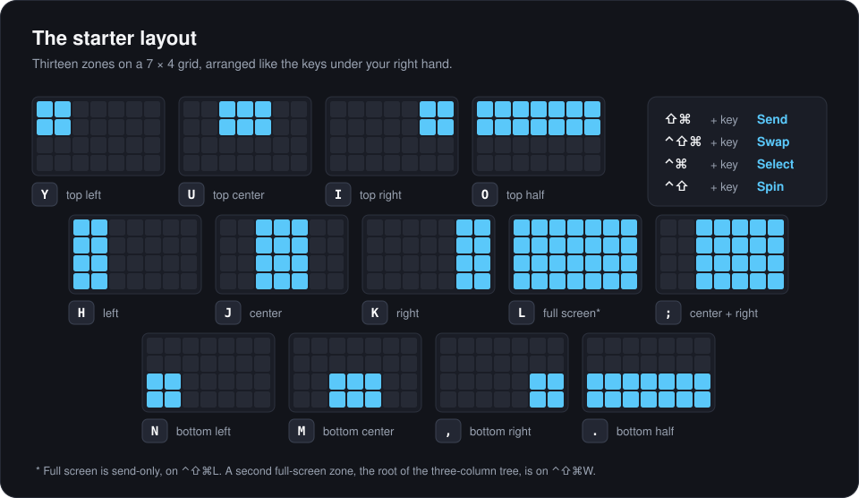

<p align="center">
  
</p>

<h1 align="center">Stackz</h1>

<p align="center">
  <strong>A keyboard-driven window manager for macOS that thinks in stacks.</strong><br/>
  Send windows to zones, swap them, and flip through whatever is piled up in each one.<br/>
  The layout rearranges itself as you go.
</p>

<p align="center">
  
  
  <a href="LICENSE"></a>
</p>

<!-- A short screen recording of Send, Swap and Spin belongs here. -->

Snapping tools give you halves and thirds, then leave you to dig through whatever ends up piled in each spot. Tiling window managers never let windows overlap, so one more app squeezes everything else.

Stackz treats each part of the screen as a **stack**: a zone that holds a pile of windows, all the same size, one on top. Four actions work on stacks, and each is a single shortcut:

| Action | What it does |
|--------|--------------|
| **Send** | Puts the focused window in a zone. |
| **Swap** | Trades places with the window on top of another zone. |
| **Select** | Jumps focus to a zone. |
| **Spin** | Flips through the windows piled in a zone, with a thumbnail switcher. |

Zones nest, and that is what keeps the screen tidy without any effort from you:

<p align="center">
  
</p>

Stackz is a menu bar app in about 3,600 lines of Swift. Its one dependency is [Sparkle](https://sparkle-project.org), for updates, and the update check is the only network request it ever makes.

## Install

```bash
curl -fsSL https://raw.githubusercontent.com/indiefan/stackz/main/install.sh | bash
```

That puts `Stackz.app` in `/Applications` (or `~/Applications` if you can't write there) and opens it. It needs macOS 13 or later and never asks for sudo.

The installer uses the latest signed and notarized release when there is one, and refuses any download that isn't signed with the Stackz developer certificate. When no release is available it builds from source instead, which needs Apple's Command Line Tools (`xcode-select --install`) and takes about a minute. Each release is also attached to the [releases page](https://github.com/indiefan/stackz/releases) as `Stackz.zip`, if you would rather download it yourself.

To read the script before running it, or to build from source by choice, clone the repository and run the same installer from the checkout:

```bash
git clone https://github.com/indiefan/stackz.git
cd stackz
./install.sh
```

### First launch

1. macOS asks for **Accessibility** access. Turn Stackz on under System Settings → Privacy & Security → Accessibility. It can't move windows without it. If shortcuts don't respond right after granting it, quit and reopen Stackz.
2. Optionally allow **Screen Recording** in the same place. Stackz only uses it to show window thumbnails in the Spin switcher.
3. The Settings window opens, and a grid icon appears in the menu bar. There is no Dock icon.

Then focus any window and press <kbd>⇧</kbd><kbd>⌘</kbd><kbd>J</kbd>.

### Updates

Release builds update themselves. On its second launch Stackz asks whether it may check for updates automatically. If you agree, it looks once a day and tells you when a new version is ready; the menu bar menu shows Update Available… until you have dealt with it. You can change your answer in Settings → General, and check by hand at any time with Check for Updates… in the same menu. Every update is verified against the developer's signing key before it is installed.

A copy built from source has no updater. Run the installer again, or pull and rebuild.

## The starter layout

The way to picture a Stackz layout is as a tree. A stack can be split into two substacks, each of those can be split again, and the whole screen is the root. The starter layout is one such tree on a 7 × 4 grid: the full screen splits into the left two columns and the remaining five, those five split into the center and right columns, and every column splits into a top and a bottom.

<p align="center">
  
</p>

What makes the tree useful is that stacks split themselves. You never carve the screen up by hand; you send windows to the nodes you want, and the windows above them make room:

- Your browser fills the screen, so it sits in the root.
- Send a terminal to the left column (<kbd>H</kbd>). That node is below the root, so the browser can't stay where it was: it slides into the other branch, the five right-hand columns (<kbd>;</kbd>). The screen is now split in two.
- Send a chat window to the right column (<kbd>K</kbd>). That is below the browser's new stack, so the browser slides again, into the center column (<kbd>J</kbd>). Three columns.
- Send the browser back up to the five columns (<kbd>;</kbd>). The chat window's stack is below that node, so it merges in behind the browser, and Spin flips between them.

The rule is always the same: a window sent into a node pushes whatever was in that node's ancestors down into the sibling branch, and a window sent into a node pulls whatever was in its descendants up behind it. Windows elsewhere in the tree stay put.

Every split has a main branch (solid in the diagram) and a minor one (dashed). The main branch is the one the tree descends when a window arrives from another display. A second, two-node tree splits the full screen into a top half (<kbd>O</kbd>) and a bottom half (<kbd>.</kbd>) for the times a wide layout fits better.

Those same thirteen zones sit under your right hand. The top row of keys targets the top of the screen, the bottom row targets the bottom, and the home row takes the full height:

<p align="center">
  
</p>

The modifiers choose the action and the key chooses the zone:

| Action | Shortcut | Example |
|--------|----------|---------|
| Send | <kbd>⇧</kbd><kbd>⌘</kbd> + key | <kbd>⇧</kbd><kbd>⌘</kbd><kbd>J</kbd> puts the focused window in the center column |
| Swap | <kbd>⌃</kbd><kbd>⇧</kbd><kbd>⌘</kbd> + key | <kbd>⌃</kbd><kbd>⇧</kbd><kbd>⌘</kbd><kbd>K</kbd> trades places with the window on top of the right column |
| Select | <kbd>⌃</kbd><kbd>⌘</kbd> + key | <kbd>⌃</kbd><kbd>⌘</kbd><kbd>H</kbd> focuses the window on top of the left column |
| Spin | <kbd>⌃</kbd><kbd>⇧</kbd> + key | <kbd>⌃</kbd><kbd>⇧</kbd><kbd>J</kbd> flips through the windows in the center column |

A few shortcuts aren't tied to a zone:

| Shortcut | Action |
|----------|--------|
| <kbd>⌃</kbd><kbd>⇧</kbd><kbd>Tab</kbd> | Spin whichever stack the focused window is in |
| <kbd>⌃</kbd><kbd>⇧</kbd><kbd>⌘</kbd><kbd>S</kbd> | Sort every loose window into the nearest stack |
| <kbd>⇧</kbd><kbd>⌘</kbd><kbd>P</kbd> | Send the focused window to the next display |
| <kbd>⌃</kbd><kbd>⇧</kbd><kbd>⌘</kbd><kbd>P</kbd> | Swap with the next display |
| <kbd>⌃</kbd><kbd>⌘</kbd><kbd>P</kbd> | Focus the next display |

> [!NOTE]
> These are global shortcuts, so they win over any app shortcut on the same keys. With the starter layout that includes <kbd>⇧</kbd><kbd>⌘</kbd><kbd>N</kbd>, <kbd>⇧</kbd><kbd>⌘</kbd><kbd>P</kbd> and <kbd>⌃</kbd><kbd>⇧</kbd><kbd>Tab</kbd>, which many apps use. Every shortcut can be rebound or cleared in Settings.

The layout itself is only a starting point. Change the grid, redraw the zones, or delete everything and build your own.

## How it works

### Stacks

Stackz divides each display's usable area (everything except the menu bar and the Dock) into a grid. A stack is a rectangle of grid cells. A window is in a stack when its frame matches that rectangle, so there is nothing to tag or keep track of: drag a window somewhere else and it has simply left its stack.

### The four actions

**Send** moves the focused window into a stack and brings it to the front. Any windows that should make room are moved first; see the next section.

**Swap** trades the focused window with the window on top of the target stack. Focus stays where your eyes are, on the window that arrives. If the target stack is empty, or the focused window isn't in a stack yet, Swap behaves like Send.

**Select** focuses the window on top of a stack. Nothing moves.

**Spin** steps through every window in a stack, front to back. Hold the modifiers and tap the key: a switcher shows a thumbnail of each window, and each step raises that window so you see it in place. Let go of the modifiers to stay on the current one. Global Spin does the same for whichever stack the focused window is in, or for all the loose windows on that display if it isn't in one.

### Splits and auto-routing

A stack can be split into two substacks, a main one and a minor one, and each of those can be split again; the tree diagram above shows the starter layout's two trees. When you Send a window, Stackz looks at the other windows on that display that are sitting in stacks and applies two rules:

- **Split.** If you send into a substack of the stack a window occupies, that window moves to the sibling branch, out of the way.
- **Merge.** If you send to a stack that contains the one a window occupies, that window moves up into the same stack, directly behind the window you sent.

Windows in unrelated branches stay where they are. The diagram at the top of this page is those two rules in action: sending Shell left splits Browser off to the right, sending Chat right splits it again, and sending Browser back to the wide zone merges Chat in behind it.

### Sort

**Sort into Stacks** sweeps up every window that isn't in a stack and drops it into the nearest one, on every display at once, without changing focus or which window is on top. Nearest is measured against the layout you are actually using: if a display is currently split into three columns, its loose windows go to one of those columns rather than to full screen.

Sorting can also run by itself when displays are connected or disconnected, and when the Mac wakes or you log in. Both switches are in Settings → General, and both are on in the starter config.

### Multiple displays

Stackz uses one layout for every display, scaled to each display's size, so <kbd>⇧</kbd><kbd>⌘</kbd><kbd>J</kbd> always means the center column of whichever display the focused window is on. Three more actions cross between displays:

| Action | What it does |
|--------|--------------|
| **Send to Next Monitor** | Moves the focused window to the next display, into the main branch of the layout there: the largest main stack that already holds a window, or full screen if that display is empty. |
| **Swap with Next Monitor** | Trades the focused window with the window in the same stack on the next display. |
| **Select Next Monitor** | Focuses the top window in the next display's main stack. |

### Active stack border

Stackz outlines the stack that holds the focused window, so you can always see which pile you are working in. The outline disappears when the focused window isn't in a stack. A static purple outline is the default, and an animated glow is one switch away in Settings → General.

## Settings

Click the grid icon in the menu bar and choose Settings. The window also opens whenever Stackz starts.

- **General** holds the grid size (2 to 24 columns and rows), the shortcuts that aren't tied to a zone, the border switches, the auto-sort switches and, in release builds, the automatic update check.
- **Stacks** shows your stacks as a tree. Double-click one to redraw it on the grid or change its four shortcuts. **Split** divides a stack in two, **New Stack** starts a new tree, and **Reset All** deletes every stack and clears every shortcut.

To record a shortcut, click its field and press the keys. <kbd>Esc</kbd> cancels and <kbd>Delete</kbd> clears it. A shortcut needs <kbd>⌘</kbd>, <kbd>⌃</kbd> or <kbd>⌥</kbd>; Shift alone isn't accepted, because it would swallow ordinary typing.

### The config file

Everything is stored in `~/.stackz.json`, a plain JSON file you can back up, diff or keep with your dotfiles:

```json
{
  "gridConfig": { "columns": 7, "rows": 4 },
  "stacks": [
    { "id": "F27637A2-…", "parentId": "CC01492C-…", "isMain": false,
      "startCol": 0, "endCol": 1, "startRow": 0, "endRow": 3 }
  ],
  "shortcuts": {
    "send_F27637A2-…": { "keyCode": 4, "modifierFlagsRaw": 1179648 },
    "sortIntoStacks": { "keyCode": 1, "modifierFlagsRaw": 1441792 }
  },
  "showActiveStackBorder": true,
  "animateActiveStackBorder": false,
  "autoSortOnDisplayChange": true,
  "autoSortOnWake": true
}
```

Stackz rewrites the file whenever you change a setting, so quit Stackz before editing it by hand. To get the starter layout back, quit Stackz, delete the file and reopen the app.

## Permissions and privacy

| Permission | Used for | Required |
|------------|----------|----------|
| Accessibility | Reading and setting window positions, and focusing windows | Yes |
| Screen Recording | Window thumbnails in the Spin switcher | No |

- The update check is the only network request Stackz makes. Release builds fetch a small feed file from github.com, once a day and only if you allow it. The request names the Stackz version and says nothing about you or your Mac. There is no telemetry and no analytics, and a copy built from source makes no network requests at all.
- Window thumbnails are held in memory for the switcher and never written to disk.
- A debug log is written to `$TMPDIR/stackz.log` and cleared at each launch. It records the actions Stackz took and the names of the apps whose windows it handled. It never records window titles or contents.
- Your shortcuts are registered with the system hotkey API, which only delivers the combinations you have bound. Stackz also installs a key monitor so it can record new shortcuts in Settings. That monitor ignores every key press unless a shortcut field is waiting for input.
- Stackz calls one private macOS function, `_AXUIElementGetWindow`, to match accessibility windows to window IDs, as Rectangle does. That rules out the Mac App Store.

## Limitations

- One layout is shared by all displays. Per-display layouts aren't supported yet.
- A window is only in a stack if it can take that exact size. Apps that enforce their own sizes, such as fixed-size windows or terminals that resize in whole character cells, can land a few points off, and Stackz then treats them as loose windows.
- Stackz works within the current Space and leaves minimized, hidden and native full-screen windows alone.
- There is no launch-at-login switch yet. Add Stackz under System Settings → General → Login Items if you want it at startup.
- A copy built from source without a signing certificate is ad-hoc signed, and macOS treats every such build as a new app. After rebuilding one, you may have to remove Stackz from the Accessibility list and allow it again. Signed releases don't have this problem.

## Building from source

```bash
git clone https://github.com/indiefan/stackz.git
cd stackz
./build.sh              # Stackz.app for this Mac's architecture
./build.sh --universal  # arm64 + x86_64
open Stackz.app
```

`build.sh` compiles with SwiftPM, which fetches Sparkle on the first run. It then assembles the app bundle and signs it with an Apple Development certificate if your keychain has one, falling back to an ad-hoc signature. A real certificate keeps macOS from asking for Accessibility again after every rebuild. These builds have the updater switched off, so a copy you are working on never replaces itself with a release.

`swift build` and `swift test` work too. SwiftPM alone doesn't produce the `.app` bundle or include the starter config, so use `build.sh` for anything you intend to run. Signed releases are covered in [RELEASING.md](RELEASING.md).

```bash
swift test
```

The unit tests cover the grid math, shortcut parsing, config filtering and the split and merge router. They run against the real AppKit and Carbon layers with a throwaway config file in the temp directory, so your own `~/.stackz.json` is not touched.

To watch what Stackz is doing:

```bash
tail -f "$TMPDIR/stackz.log"
```

### Source layout

| File | Role |
|------|------|
| `StackzApp.swift` | Entry point: menu bar item, Settings window, Accessibility prompt |
| `Models.swift` | `UserStack`, `GridConfig`, `Shortcut`, and `StackRouter`, which holds the split and merge rules |
| `WindowManager.swift` | Send, Swap, Select, Spin, Sort and the next-display actions |
| `StackStore.swift` | Stacks, grid and feature switches, saved on every change |
| `HotkeyStore.swift` | Global hotkey registration and dispatch through the Carbon event API |
| `AppConfigManager.swift` | Reads and writes `~/.stackz.json`, and loads the bundled starter config on first run |
| `SpinSessionManager.swift` | State machine for a Spin session and its modifier tracking |
| `SpinOverlay.swift` | The Spin switcher |
| `ActiveStackManager.swift` | Watches the focused window to work out which stack is active |
| `ActiveStackOverlayManager.swift` | Draws the active stack border |
| `ZOrderLookup.swift` | Window list queries: z-order, windows in a rectangle, thumbnails |
| `AccessibilityElement.swift`, `AXExtension.swift`, `AXPrivate.swift` | Wrappers around the Accessibility API |
| `SettingsView.swift` | The Settings window, grid editor and shortcut recorder |
| `UpdateController.swift` | The Sparkle updater, its menu item and its Settings switch |
| `Logger.swift` | The debug log |

## Uninstall

```bash
pkill -x Stackz
rm -rf /Applications/Stackz.app
rm ~/.stackz.json
defaults delete io.github.indiefan.stackz 2>/dev/null
```

Then remove Stackz from System Settings → Privacy & Security → Accessibility, and from Screen Recording if you allowed it.

## Contributing

Issues and pull requests are welcome. For anything larger than a bug fix, please open an issue first so the approach can be agreed before you write the code. Run `swift test` before sending a pull request.

## Acknowledgments

The Accessibility wrappers in `Sources/AXExtension.swift` and `Sources/AccessibilityElement.swift` come from [Rectangle](https://github.com/rxhanson/Rectangle) by Ryan Hanson, used under the MIT license. Updates are delivered by [Sparkle](https://sparkle-project.org). See [THIRD_PARTY_NOTICES.md](THIRD_PARTY_NOTICES.md) for both licenses.

## License

[MIT](LICENSE)
